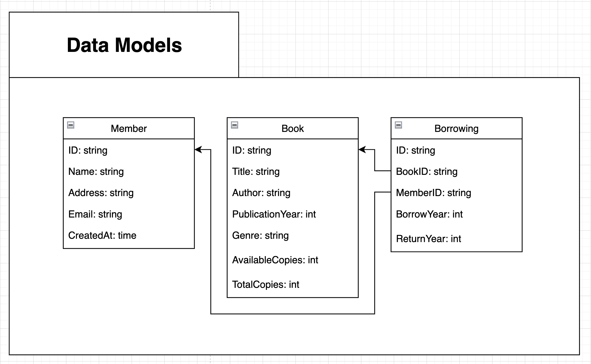
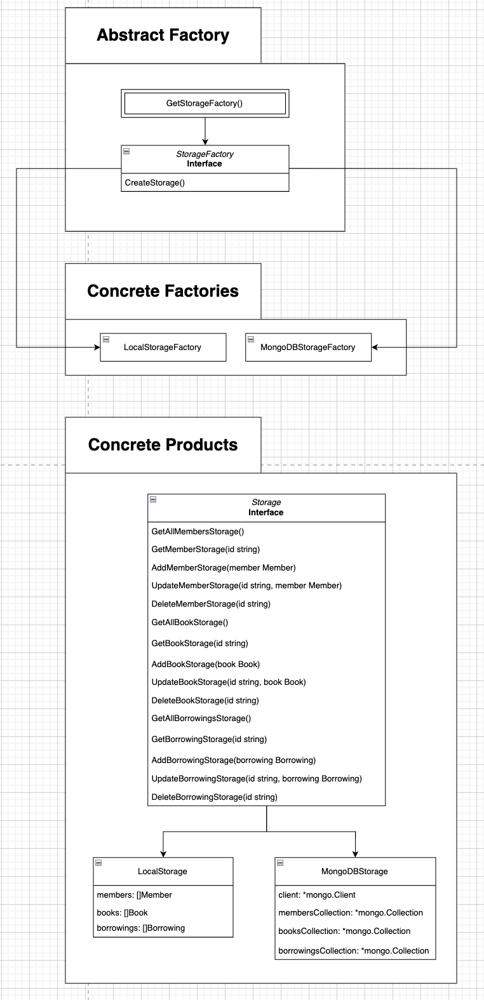
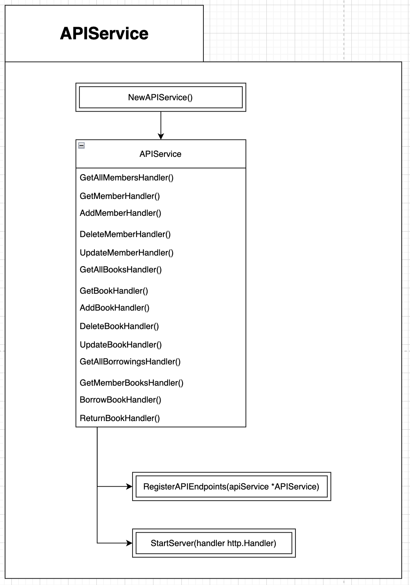
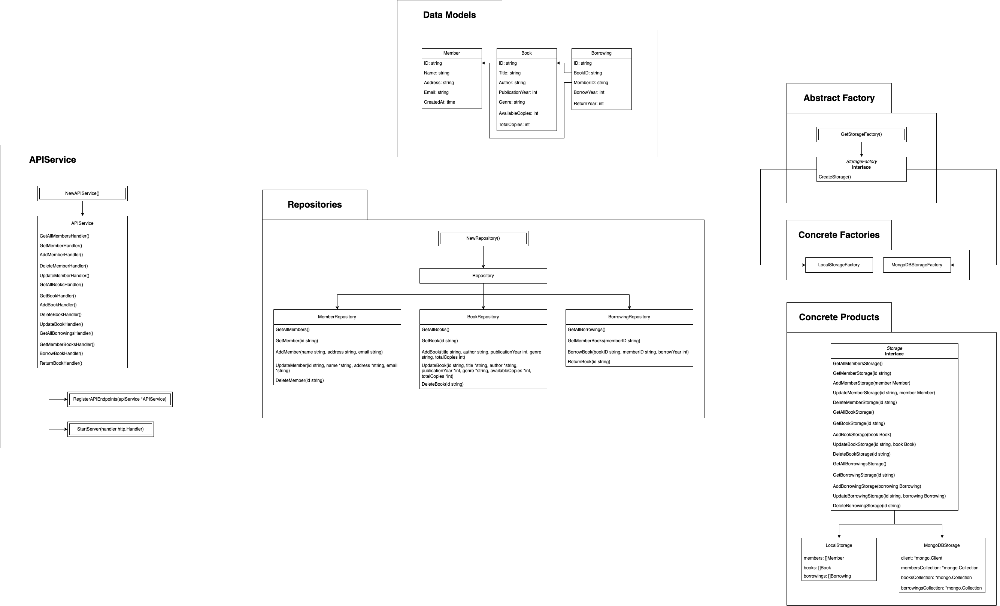

# Косяков Матвей гр. 253505
### Проект "Library Management System API"

***Описание:***
Система менеджмента библиотеки - это программное обеспечение, предназначенное для автоматизации основных библиотечных процессов. Она позволяет организовать и упростить хранение, поиск, выдачу и возврат книг, а также управление информацией о читателях библиотеки.

***Цель проекта:***
повысить эффективность работы библиотеки, улучшить доступ к ее ресурсам и облегчить взаимодействие между библиотекарями и читателями.

## 1. Модели данных:

### Модель Member:
- ID (string): Уникальный идентификатор члена библиотеки.
- Name (string): Имя члена библиотеки.
- Address (string): Адрес проживания члена библиотеки.
- Email (string): Электронная почта члена библиотеки.
- CreatedAt (time): Время регистрации члена библиотеки в системе.

### Модель Book:
- ID (string): Уникальный идентификатор книги.
- Title (string): Название книги.
- Author (string): Автор книги.
- PublicationYear (int): Год публикации книги.
- Genre (string): Жанр книги.
- AvailableCopies (int): Количество доступных копий книги.
- TotalCopies (int): Общее количество копий книги в библиотеке.

### Модель Borrowing:
- ID (string): Уникальный идентификатор записи о заимствовании книги.
- BookID (string): Идентификатор книги, которая была заимствована.
- MemberID (string): Идентификатор члена библиотеки, который заимствовал книгу.
- BorrowYear (int): Год, в котором книга была заимствована.
- ReturnYear (int): Год, в котором книга была возвращена.

Все модели используют строковый тип данных для идентификаторов, что позволяет им быть гибкими, использовать ObjectID() для генерации идентификаторов и иметь структуру для потенциального хранения их в MongoDB.
Модель Member хранит базовую информацию о читателях.
Модель Book хранит основную информацию о книгах.
Модель Borrowing отслеживает заимствования книг.
Все типы связи в моделях имеют отношение One-to-Many.

## 2. Инструменты для хранения данных:

## 2.1. Абстрактная фабрика:
- **StorageFactory:** Абстрактная фабрика, представленная интерфейсом. Интерфейс не содержит никаких реализаций, он лишь задает общий контракт для создания объектов хранения.

## 2.2. Конкретные фабрики:
- **LocalStorageFactory:** Фабрика, которая отвечает за создание экземпляров LocalStorage. Является конкретной реализацией интерфейса StorageFactory.
- **MongoDBStorageFactory:** Фабрика, которая отвечает за создание экземпляров MongoDBStorage. Является конкретной реализацией интерфейса StorageFactory. Эта фабрика более сложная, так как ей необходимо подключиться к базе данных MongoDB, создать коллекции для книг, читателей и заимствований, а затем вернуть новый объект MongoDBStorage.

## 2.3. Конкретные продукты:
- **Storage** Интерфейс, который декларирует CRUD-методы для работы с книгами (Book), читателями (Member) и заимствованиями (Borrowing).
  - **LocalStorage, MongoDBStorage:** Конкретные реализации интерфейса для хранения членов библиотеки, книг и заимствования книг локально и с помощью базы данных MongoDB соответственно.

## 2.4. Методы:
StorageFactory:
- CreateStorage(): Создает объект реализации интерфейса Storage в зависимости от конкретной фабрики.

Storage:
- GetAllMembersStorage(): Возвращает список всех читателей.
- GetMemberStorage(id string): Возвращает информацию о конкретном читателе по его ID.
- AddMemberStorage(member Member): Добавляет нового читателя в библиотеку, принимая объект Member с его данными.
- UpdateMemberStorage(id string, member Member): Обновляет информацию о читателе по его ID, принимая объект Member с новыми данными.
- DeleteMemberStorage(id string): Удаляет читателя по его ID.
- GetAllBooksStorage(): Возвращает список всех книг.
- GetBookStorage(id string): Возвращает информацию о конкретной книге по ее ID.
- AddBookStorage(book Book): Добавляет новую книгу в библиотеку, принимая объект Book с ее данными.
- UpdateBookStorage(id string, book Book): Обновляет информацию о книге по ее ID, принимая объект Book с новыми данными.
- DeleteBookStorage(id string): Удаляет книгу из библиотеки по ее ID.
- GetAllBorrowingsStorage(): Возвращает список всех заимствований книг.
- GetBorrowingStorage(id string): Возвращает информацию о конкретном заимствовании по его ID.
- AddBorrowingStorage(borrowing Borrowing): Добавляет новое заимствование книги, принимая объект Borrowing с его данными.
- UpdateBorrowingStorage(id string, borrowing Borrowing): Обновляет информацию о заимствовании по его ID, принимая объект Borrowing с новыми данными.
- DeleteBorrowingStorage(id string): Удаляет заимствование книги по его ID.

## 2.4. Конструкторы:
- GetStorageFactory(): принимает тип хранилища ("local" или "mongodb") и возвращает соответствующую фабрику.

## 3. Бизнес-логика:

## 3.1. Repository:
- Репозиторий представляет собой слой бизнес-логики. Он имеет доступ к данным, взаимодействует с хранилищем (Storage). Репозитории для читателей (MemberRepository), книг (BookRepository) и заимствований (BorrowingRepository) дополняют структуру класса Repository.

## 3.2. Конкретные репозитории:
- **MemberRepository, BookRepository, BorrowingRepository** Репозитории, которые реализуют бизнес-логику конкретной модели данных.

## 3.3. Методы:
MemberRepository:
- GetAllMembers(): Возвращает список всех читателей.
- GetMember(id string): Возвращает информацию о конкретном читателе.
- AddMember(name string, address string, email string): Добавляет нового читателя в библиотеку.
- UpdateMember(id string, name *string, address *string, email *string): Обновляет информацию о читателе.
- DeleteMember(id string): Удаляет читателя.

BookRepository:
- GetAllBooks(): Возвращает список всех книг.
- GetBook(id string): Возвращает информацию о конкретной книге.
- AddBook(title string, author string, publicationYear int, genre string, totalCopies int): Добавляет новую книгу в библиотеку.
- UpdateBook(id *string, title *string, author *string, publicationYear *int, genre *string, availableCopies *int, totalCopies *int): Обновляет информацию о книге.
- DeleteBook(id string): Удаляет книгу из библиотеки.

BookRepository:
- GetAllBorrowings(): Возвращает список всех заимствований книг.
- GetMemberBooks(memberID string): Возвращает список книг, заимствованных конкретным читателем.
- BorrowBook(bookID string, memberID string, borrowYear int): Зарегистрировать заимствование книги.
- ReturnBook(id string): Зарегистрировать возврат книги.

## 3.4. Конструкторы:
- NewRepository(): создает класс Repository.

## 4. Сервис, предоставляющий API:

## 4.1. Реализация:
- **APIService** - это сервис, который предоставляет API. Он использует слой бизнес-логики (Repository) в котором происходит основные манипуляции с данными, а затем записываются в хранилище. APIService реализует обработку API-запросов. Его методы используют в своей реализации методы класса Repository.

## 4.2. Методы (обработчики API-запросов):
Member:
- getAllMembersHandler(): использует метод GetAllMembers. *GET /members*
- getMemberHandler(): использует метод GetMember. *GET /members/{memberID}*
- addMemberHandler(): использует метод AddMember. *POST /members*
- deleteMemberHandler(): использует метод DeleteMember. *DELETE /members/{memberID}*
- updateMemberHandler(): использует метод UpdateMember. *PUT /members/{memberID}*

Книги:
- getAllBooksHandler(): использует метод GetAllBooks. *GET /books*
- getBookHandler(): использует метод GetBook. *GET /books/{bookID}*
- addBookHandler(): использует метод AddBook. *POST /books*
- deleteBookHandler(): использует метод DeleteBook. *DELETE /books/{bookID}*
- updateBookHandler(): использует метод UpdateBook. *PUT /books/{bookID}*

Заимствования:
- getAllBorrowingsHandler(): использует метод GetAllBorrowings. *GET /borrowings*
- getMemberBooksHandler(): использует метод GetMemberBooks. *GET /borrowings/{memberID}*
- borrowBookHandler(): использует метод BorrowBook. *POST /borrowings*
- returnBookHandler(): использует метод ReturnBook. *PUT /borrowings/{borrowingID}*

## 3.3. Конструктор:
- NewAPIService(): Создает экземпляр сервиса APIService. Реализация конструктора создает singleton, что означает, что в рамках приложения будет существовать только один экземпляр APIService.

## 3.4. Дополнительные функции:
- RegisterAPIEndpoints(apiService *APIService): Регистрирует обработчики API-запросов для сервиса.
- StartServer(handler http.Handler): Запускает сервер.

## 4. Общая структура проекта:

